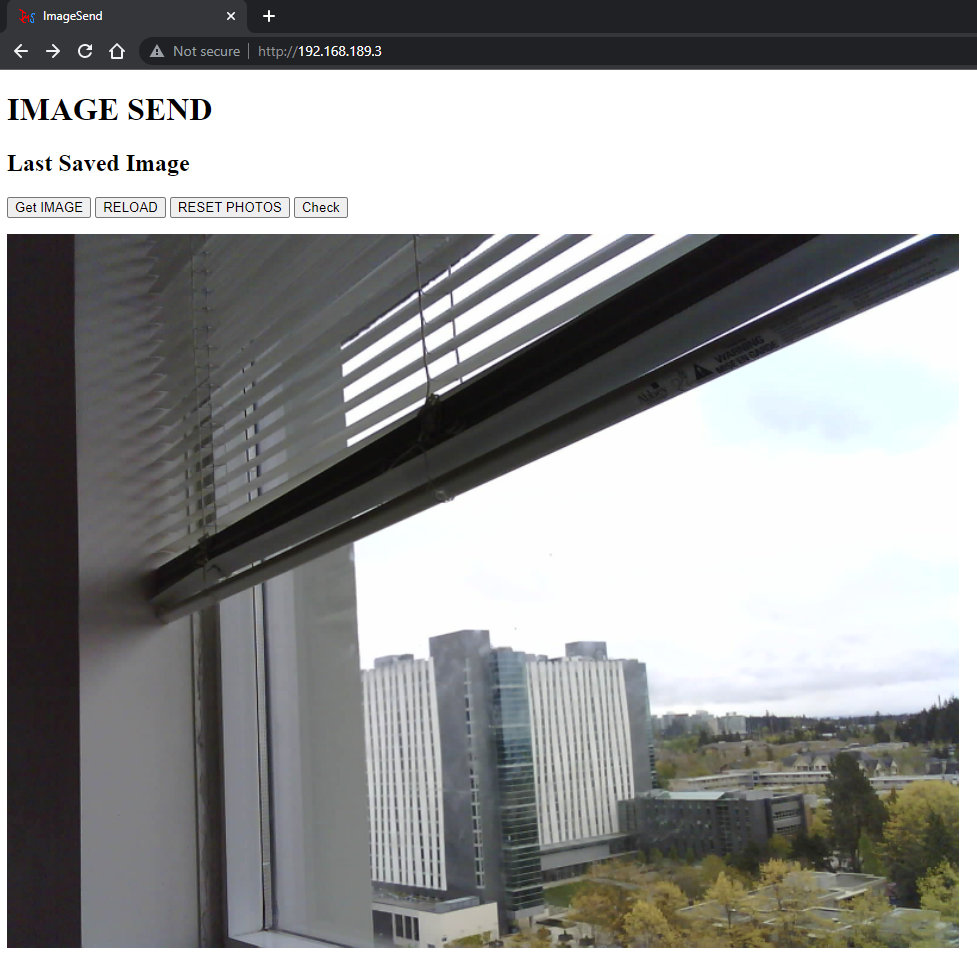

# ImageSend
***
Sends images from ESP32 to connected clients. Saves it on SD card as well. 

# Installation 
***
* <a href="https://github.com/Nischay2312/ImageSend/archive/refs/heads/main.zip">Download</a> all files.
* I am using an <a href="https://www.amazon.ca/dp/B07T9561M7?ref_=cm_sw_r_cp_ud_dp_KTVPAZV23P31JB4JG0W4">ESPCam</a> but it can work on other boards as well. You will need to figure out the pins for camera. See <a href = "PinAssignment.h"> this </a> for my pin assignments.
* You will need to <a href="https://randomnerdtutorials.com/installing-the-esp32-board-in-arduino-ide-windows-instructions/">add ESP32 in Arduino board manager.</a> Aditionally you also need <a href="https://github.com/me-no-dev/ESPAsyncWebServer">ESPAsyncWebServer</a> and <a href="https://github.com/me-no-dev/AsyncTCP">AsyncTCP</a> libraries to get the project wokring.
* If you want to use the SD Card then set SAVE_SD = 1 in .ino file. Copy all the files inside the SDCard folder into an SD Card (I am using a <a href="https://www.amazon.ca/dp/B07F81VC69?ref_=cm_sw_r_cp_ud_dp_W0GH1Y5BYVFPK9ZBS531">$7 16GB one</a>, it works fine). If you plan to use the onboard SPIFFS then set SAVE_SD = 0 in the .ino file.
* Change your WiFi credentials in the .ino file.
* Set up the board with the following pinout(for ESPcam):  RX    -> U0T TX    -> U0R 5V    -> VCC(5V) GND   -> GND GPIO0 -> GND        (This sets the ESPCam into program mode) Youl will need an <a href="https://www.amazon.ca/dp/B01JG8H5U4?ref_=cm_sw_r_cp_ud_dp_CZVW7NPZDQ7AMHV7MEAR">external FTDI programmer</a> for ESPCam. The RX, TX, 5V, GND are the pins from the FTDI Programmer. For regular ESP boards, you can directly program it as usual.
* Once you program it, remove the connection between GPIO0 and GND(only for ESPCam). 
* Program the board and open the serial monitor. Reset the ESP. You should see it connecting to WiFi with dots being printed, if the connection cannot be setup in 5 seconds, the ESP will restart. You can change the timout value in the .ino file. Once everything if fine you should see the IP address to access the server. Keep in mind the the accessing computer also needs to be on the same WiFi network. You should see the UI below without the picture. 
* Press "Get Image" to take a picture, the camera lights should flash. Then click "Reload" or reload the page to see the image.

<h3>User Interface</h3> 

# Updates
Log of what was done throughout the timeline of the project.
***
<b>June 1, 2022:<b> 
* Proud to present you Google Image Search capability. Click a picture from the website using the "GET IMAGE" button, and run <a href="https://github.com/Nischay2312/ImageSend/blob/main/python/ImageSendpython.py">this</a> python script. The terminal displays the Google Image Search results for the image captured using the ESP. The feature is planned to be used as identifying coomon objects in the fram using Google's image recognition platform. 
* Fixed the google redirect issue, added http headers to the request allowing the python script to not being detected as bot by Google.
* Note: The code works at the moment but hasn't been fully tested, so errors might pop up. I am currently testing the code and trying to catch errors.
  
<b>May 18, 2022:<b> 
* Introduced Image download functionality. Python script periodically checks the server for a new image, once there is one, it downloads it. Now further modifications include processing it.
* Added options to use external WiFi network or ESP's soft access point to host the web server.
* Implemented ESP WiFi connection timeout. If the ESP does not connect to the specified WiFi network within 5 seconds, the firmware resets the board.    
  
<b>May 14, 2022:</b> 
* Added functionality to read HTML pages from SD Card. Therby adding more flexiblity for better and more <b><u><i>colourful</i></u></b> web pages. Just change the SAVE_SD to 1 to enable SD card. 
* All the website resources are in the SD card folder. Just copy contents of that to the root of your SD card.  
* Added custom designed website icon. ->  

<b>May 13, 2022:</b> 
* Improved Web scrapping. Periodically check a web page at ESP server to see if user added a new photo.
* Updated UI. 

<b>May 12, 2022:</b> 
* Added code functionality to check for a new image via a GET request. (Useful for later as we need to implement automation using python)
* Started Python part. Added a basic webscrapper function to check if a particular text is in a webpage.  

<b>May 11, 2022:</b> 
* Added code to save image on SD Card. (Can disable and use just the onboard SPIFFS)
* Image Webserver setup to hande GET request for Click and Display images and Reset the internal image counter. 
* Added firmware to set up only one of SD card or the SPIFFS, with different image settings (SD: UXGA, SPIFFS: SVGA)

<b>May 10, 2022:</b> 
* Initial commit and repository setup.

