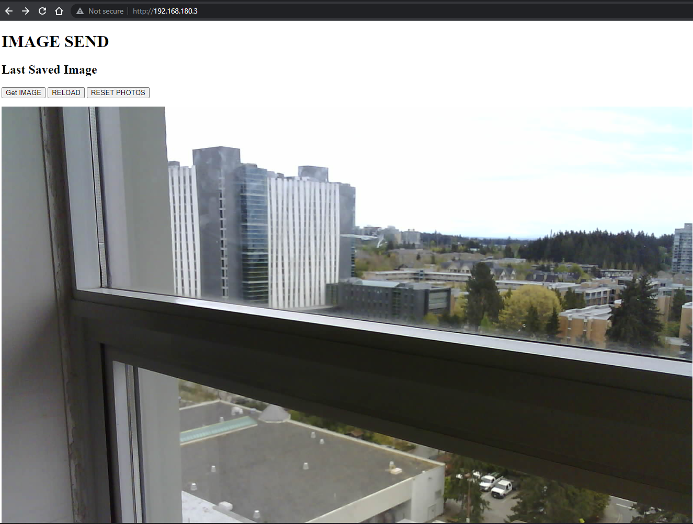

# ImageSend
***
Sends images from ESP32 to connected clients. Saves it on SD card as well. 

<h3>UI</h3> 

# Updates
Log of what was done throughout the timeline of the project.
***
<b>May 12, 2022:</b> 
* Added code functionality to check for a new image via a GET request. (Useful for later as we need to implement automation using python)
* Started Python part. Added a basic webscrapper function to check if a particular text is in a webpage.  

<b>May 11, 2022:</b> 
* Added code to save image on SD Card. (Can disable and use just the onboard SPIFFS)
* Image Webserver setup to hande GET request for Click and Display images and Reset the internal image counter. 
* Added firmware to set up only one of SD card or the SPIFFS, with different image settings (SD: UXGA, SPIFFS: SVGA)

<b>May 10, 2022:</b> 
* Initial commit and repository setup.

